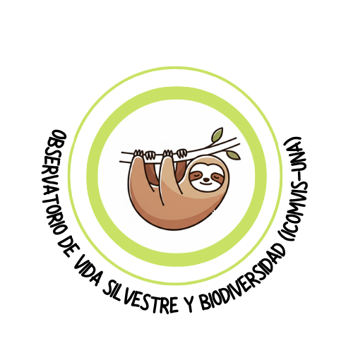

```{r}
#| context: setup
#| warning: false
#| message: false
library(shiny)
library(shinychat)
library(ellmer)
library(bslib)
```

# Con la ayuda de Talentoso, el oso perezoso sabio

::: text-center
{width="50%"}

*Ilustración por Gemini 2.0 Flash y Maritza Ramírez*
:::

```{r}
#| panel: sidebar
h4("Ejemplos de preguntas")

p("• ¿Cuáles parques nacionales hay en Guanacaste?")
p("• ¿Qué especies de aves son comunes en Monteverde?")
p("• ¿Por qué Costa Rica es un hotspot de biodiversidad?")
p("• Nómbrame cinco especies endémicas de Costa Rica")
```

```{r}
#| panel: fill
#| echo: false
chat_ui("chat", placeholder = "Escribe tu pregunta aquí...")
```

```{r}
#| context: server
observe({
  chat_append("chat", '<span style="font-size: 22px;">🦥 Hola, soy Talentoso, un oso perezoso dispuesto a responder tus preguntas sobre la biodiversidad de Costa Rica. ¡Tranqui! te ayudo con calma. </span>')
})
```

```{r}
#| context: server
chat <- ellmer::chat_google_gemini(
  model = "gemini-2.5-flash",
  system_prompt = "
Responde únicamente preguntas relacionadas con la biodiversidad de Costa Rica, incluyendo especies, ecosistemas, áreas protegidas, conservación y amenazas. 
Incluye siempre al menos una fuente confiable en la respuesta, como SINAC, GBIF, o publicaciones científicas relevantes. 
Si la pregunta no está relacionada con biodiversidad, responde que solo puedes responder sobre ese tema."
)

observeEvent(input$chat_user_input, {
  req(input$chat_user_input)
  response <- chat$chat(input$chat_user_input)
  chat_append("chat", response)
})
```

::: {.footer style="text-align: center; font-size: 14px; margin-top: 40px;"}
© 2025 Observatorio de Vida Silvestre y Biodiversidad de Costa Rica, ICOMVIS-UNA. Este asistente utiliza Gemini 2.0 Flash (Google AI) como motor de lenguaje. Google no respalda ni administra esta aplicación.
:::

::: {.footer style="text-align: center; font-size: 14px; margin-top: 40px;"}
Nota: Este asistente virtual no es un experto en biodiversidad, sino un modelo de lenguaje que intenta proporcionar información precisa y útil. Sin embargo, siempre es recomendable consultar fuentes adicionales para obtener información más detallada y actualizada.
:::
